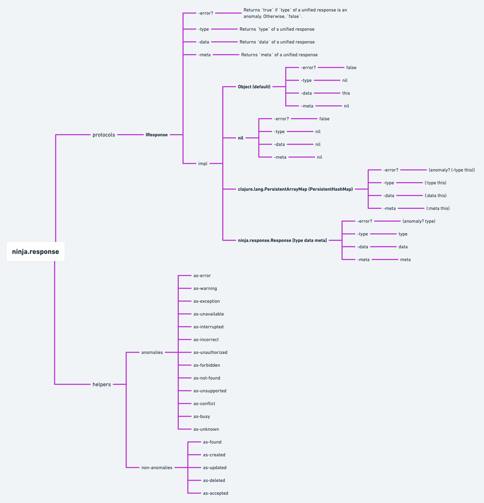

:figure-caption!:

image:https://img.shields.io/clojars/v/ninja.platform/response.svg[clojars,link=https://clojars.org/ninja.platform/response]

== ninja.platform/response

A Clojure(Script) library for the unified responses.

=== Quick Start Guide

Add the following dependency in your project:

.project.clj or build.boot
[source,clojure]
----

[ninja.platform/response "0.0.1-alpha5"]
----

.deps.edn
[source,clojure]
----
ninja.platform/response {:mvn/version "0.0.1-alpha5"}
----

=== Library API 

link:../../response/src/main/clojure/ninja/response.cljc[This library] is very simple.
It doesn't have any wrappers or types.
An as a unified response, it is used a plain `defrecord`.
It's very fast - without any overhead.
You can use any functions for the work.
If you need you can implement your own unified response - just implement `ninja.response.IResponse` protocol.
If you don't have enough predefined anomalies, just add new types of anomalies using the `add-anomaly!` or delete an existing one using the `remove-anomaly!` function.

.Library API

=== Example

.ninja.sandbox.cljc
[source,clojure]
----
(ns ninja.sandbox
  (:require
    [ninja.response :as r]))

;;;;
;; Anomalies registry API
;;;;

(r/add-anomaly! ::error) ;; => :ninja.sandbox/error
(r/anomaly? ::error) ;; => true
(r/remove-anomaly! ::error) ;; => :ninja.sandbox/error
(r/anomaly? ::error) ;; => false

;;;;
;; Unified response API
;;;;

(def res
  (r/as-response ::response "some data" {:some :meta}))

(r/error? res) ;; => false
(r/type res) ;; => :ninja.sandbox/error
(r/data res) ;; => "some data"
(r/meta res) ;; => {:some :meta}

(r/add-anomaly! ::response) ;; => :ninja.sandbox/response
(r/error? res) ;; => true

(r/error? (assoc res :type :created)) ;; => false
(str res) ;; => "#ninja/response{:type :ninja.sandbox/response, :data \"some data\", :meta {:some :meta}}"

;; You can also use a usual hash-map like this
;; Q: Why are keywords without a namespace?
;; A: This is done so that there are no differences between the usual hash-map and #ninja.response
(def m
  {:type :error
   :data "some data" 
   :meta {:some :meta}})

(r/error? m) ;; => true
(r/data m) ;; => "some data"
(r/meta m) ;; => {:some :meta}
----

=== TODO

- [ ] `ninja.meta.response` - return a unified response via metadata
- [ ] `ninja.http.response` - convert a unified response to the ring response
