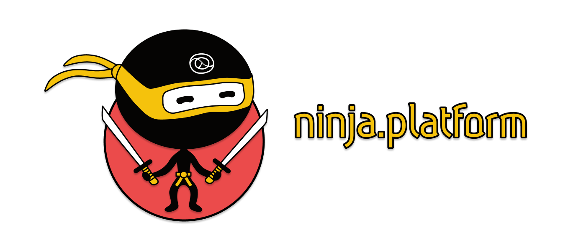

image:https://img.shields.io/github/license/just-sultanov/ninja.platform[license,link=license]

== ninja.platform

Build up projects like a ninja. This repository includes useful libraries (aka ninja tools) for everyday use.

=== ninja tools

- link:docs/ninja.tools/ninja.response.adoc[ninja.platform/response] - a Clojure(Script) library for the unified responses
- link:docs/ninja.tools/ninja.schema.adoc[ninja.platform/schema] - a Clojure(Script) library for the data schemas

=== License

Copyright © 2021 Ilshat Sultanov.

Distributed under the Eclipse Public License version 1.0.
